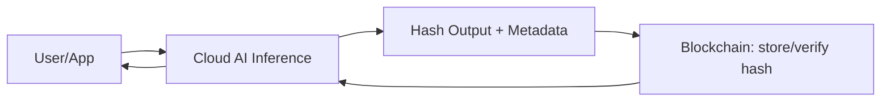

## 📚 Series Navigation  
  
👉 **Part 1: AI, Blockchain, and Cloud – Who Does What**  
👉 **[Part 2: Why Fully Decentralized AI Is Mostly a Myth](/posts/why-fully-decentralized-ai-is-a-myth/)**  
👉 **[Part 3: How Cloud ML Pipelines Power Web3 Analytics](/posts/web3-data-to-cloud-ml-pipelines/)**  
👉 **[Part 4: Smart Contracts + AI Agents](/posts/ai-for-blockchain-fraud-anomaly-detection/)**  
👉 **[Part 5: Trust, Governance, and Auditable AI](/posts/smart-contracts-ai-agents-autonomous-systems/)**  
👉 **[Part 6: What Comes Next (Predictions)](/posts/what-comes-next-predictions/)**

# Part 1: AI, Blockchain, and Cloud – Who Does What

## Introduction
AI, blockchain, and cloud computing are often discussed as if they are competing paradigms. In reality, they solve quite different engineering problems. Confusion arises when teams try to force one technology to do the job of another.

This post establishes a clear mental model for how these systems should work together in production.

## The Core Responsibilities
| Layer | Responsibility | Why It Exists |
| --- | --- | --- |
| AI | Prediction, classification, extraction | Intelligence |
| Blockchain | Immutability, ordering, verification | Trust |
| Cloud | Compute, storage, orchestration | Scale |

**Key principle:** Any architecture that violates these boundaries will fail on cost, performance, or maintainability.

## Why Blockchain Is Not a Compute Engine
Blockchains are:
- Slow  
- Deterministic  
- Expensive per operation  

They are excellent for verifying outcomes, not generating them.

## Practical Hybrid Architecture
What works in real systems:
- AI inference runs off-chain (cloud CPUs/GPUs)
- Outputs are hashed
- Hashes and metadata are stored on-chain
- Smart contracts verify integrity

## Minimal Code Example

### AI Inference (Cloud) — Python
```python
import hashlib, json

output = {"risk": 0.91, "label": "high"}

hash_value = hashlib.sha256(json.dumps(output).encode()).hexdigest()
```

### Smart Contract (Verification) — Solidity
```solidity
mapping(bytes32 => bool) public verified;

function register(bytes32 h) public {

    verified[h] = true;

}
```

## When This Pattern Makes Sense
- Financial risk scoring
- Fraud detection
- Model governance
- Compliance-driven AI

## Closing Thought
AI decides.  
Blockchain verifies.  
Cloud scales.

Trying to collapse these roles is an architectural mistake.



---

**⬅️ Previous:** [Series Index](/posts/ai-meets-web3-reality-architecture-future/)  
**➡️ Next:** [Part 2](/posts/why-fully-decentralized-ai-is-a-myth/)

