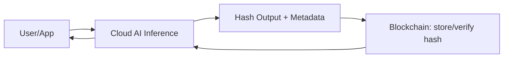

Artificial intelligence, blockchain, and cloud computing are often discussed together — and often misunderstood together.

This series is a **practical, engineer-first breakdown** of how these technologies actually interact in real production systems: what works, what fails, and what the future realistically looks like.

## 📚 Series Overview

👉 **[Part 1: AI, Blockchain, and Cloud – Who Does What](#part-1-ai-blockchain-and-cloud--who-does-what)**  
👉 **[Part 2: Why Fully Decentralized AI Is Mostly a Myth](#part-2-why-fully-decentralized-ai-is-mostly-a-myth)**  
👉 **[Part 3: How Cloud ML Pipelines Power Web3 Analytics](#part-3-how-cloud-ml-pipelines-power-web3-analytics)**  
👉 **[Part 4: Smart Contracts + AI Agents](#part-4-smart-contracts--ai-agents)**  
👉 **[Part 5: Trust, Governance, and Auditable AI](#part-5-trust-governance-and-auditable-ai)**  
👉 **[Part 6: What Comes Next (Predictions)](#part-6-what-comes-next-predictions)**

---

## 📘 Part 1: AI, Blockchain, and Cloud – Who Does What

### Introduction
AI, blockchain, and cloud computing are often discussed as if they are competing paradigms. In reality, they solve quite different engineering problems. Confusion arises when teams try to force one technology to do the job of another.

This article establishes a clear mental model for how these systems should work together in production.

### The Core Responsibilities
| Layer | Responsibility | Why It Exists |
| --- | --- | --- |
| AI | Prediction, classification, extraction | Intelligence |
| Blockchain | Immutability, ordering, verification | Trust |
| Cloud | Compute, storage, orchestration | Scale |

**Key principle:** Any architecture that violates these boundaries will fail on cost, performance, or maintainability.

### Why Blockchain Is Not a Compute Engine
Blockchains are:
- Slow  
- Deterministic  
- Expensive per operation  

They are excellent for verifying outcomes, not generating them.

### Practical Hybrid Architecture
What works in real systems:
- AI inference runs off-chain (cloud CPUs/GPUs)
- Outputs are hashed
- Hashes and metadata are stored on-chain
- Smart contracts verify integrity

### Minimal Code Example

**AI Inference (Cloud) — Python**
```python
import hashlib, json

output = {"risk": 0.91, "label": "high"}

hash_value = hashlib.sha256(json.dumps(output).encode()).hexdigest()
```

**Smart Contract (Verification) — Solidity**
```solidity
mapping(bytes32 => bool) public verified;

function register(bytes32 h) public {

    verified[h] = true;

}
```

### When This Pattern Makes Sense
- Financial risk scoring
- Fraud detection
- Model governance
- Compliance-driven AI

### Closing Thought
AI decides.  
Blockchain verifies.  
Cloud scales.

Trying to collapse these roles is an architectural mistake.



---

## 📘 Part 2: Why Fully Decentralized AI Is Mostly a Myth

### The Promise vs Reality
Decentralized AI promises trustless, censorship-resistant intelligence. The problem is physics and economics, not ideology.

### Hard Constraints Engineers Cannot Ignore
| Constraint | Why It Breaks DeAI |
| --- | --- |
| GPUs | Scarce, expensive, centralized |
| Latency | On-chain ≠ real-time |
| Cost | Inference at scale is costly |
| Tooling | ML stacks assume cloud |

### The GPU Problem
Training and inference require:
- High-bandwidth memory
- Fast interconnects
- Centralized scheduling

This naturally pushes AI workloads toward cloud hyperscalers.

### What Actually Works
- Centralized inference
- Decentralized verification
- Token incentives for contributors
- Cryptographic proofs of output

**Engineering Reality — Solidity**
```solidity
mapping(bytes32 => address) public inferenceProducer;
```

You don’t decentralize GPUs. You decentralize trust in results.

---

## 📘 Part 3: How Cloud ML Pipelines Power Web3 Analytics

### Why Blockchain Data Is Perfect for ML
Blockchains are:
- Append-only
- Time-ordered
- Public
- Behavior-rich

This makes them ideal for feature engineering.

### Reference Architecture
```text
Blockchain Node
 → S3 (raw JSON)
 → Spark (ETL + features)
 → ML model
 → Predictions on-chain
```

### PySpark Example — Python
```python
df = spark.read.json("s3://eth/tx/")

features = df.groupBy("wallet").agg(

    count("*").alias("tx_count"),

    sum("value").alias("total_value")

)
```

### ML Applications
- Wallet risk scoring
- Whale detection
- Bot identification
- Market behavior analysis

### Why Cloud Wins
Only cloud platforms provide:
- Elastic compute
- Distributed storage
- Mature ML tooling

### Closing
Web3 generates data.  
Cloud turns it into intelligence.

---

## 📘 Part 4: Smart Contracts + AI Agents

### Fraud Is Behavioral
Most blockchain attacks do not break cryptography. They exploit human and system behavior.

### Common Fraud Patterns
- Wash trading
- Sybil wallets
- Bot farms
- Flash-loan abuse

### Feature Engineering Examples
| Feature | Signal |
| --- | --- |
| tx_rate | Automation |
| counterparty_entropy | Wallet diversity |
| value_variance | Manipulation |

### Isolation Forest Example — Python
```python
from sklearn.ensemble import IsolationForest

model = IsolationForest(contamination=0.01)

model.fit(features)

risk = model.predict(features)
```

### Blockchain Integration
- Store scores on-chain
- Trigger smart-contract rules
- Maintain immutable audit trail

### Conclusion
AI detects.  
Blockchain enforces.

---

## 📘 Part 5: Trust, Governance, and Auditable AI

### The New Primitive
Smart contracts are rules.  
AI agents provide decisions.

Together, they create autonomous systems.

### Reference Architecture
```text
AI Agent (Cloud)
 → Decision
 → Smart Contract
 → On-chain Execution
```

### Solidity Guardrails — Solidity
```solidity
require(riskScore < 80, "Rejected by AI risk model");
```

### Use Cases
- Trading bots
- DAO governance
- Dynamic protocol tuning

### Engineering Risk
AI agents fail silently — but at scale. Guardrails are mandatory.

### Closing
Never let AI execute without constraints.

---

## 📘 Part 6: What Comes Next (Predictions)

### The Trust Problem
AI systems increasingly affect:
- Finance
- Credit
- Governance
- Compliance

But they are often opaque.

### Blockchain as an Audit Log
Store:
- Model hash
- Input hash
- Output hash
- Timestamp
- Signer

### Example Record — JSON
```json
{

  "model": "abc123",

  "input": "def456",

  "output": "ghi789",

  "time": 1700000000

}
```

### Why This Matters
- Regulatory audits
- Post-incident analysis
- Model accountability
- Explainability

### Final Takeaway
Blockchain doesn’t make AI smarter.  
It makes AI answerable.

---

## 🏁 Series Summary
| Technology | Role |
| --- | --- |
| AI | Intelligence |
| Blockchain | Trust |
| Cloud | Scale |

The future is not decentralized vs centralized.  
It is architecturally honest hybrid systems.

---

### 👋 About the Author
Tom Wang is a software engineer and AI practitioner focused on cloud-native systems, machine learning, and financial technology.
