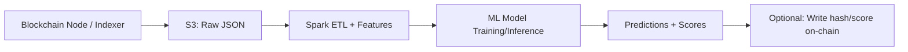

## 📚 Series Navigation  
  
👉 **[Part 1: AI, Blockchain, and Cloud – Who Does What](/posts/ai-blockchain-cloud-who-does-what/)**  
👉 **[Part 2: Why Fully Decentralized AI Is Mostly a Myth](/posts/why-fully-decentralized-ai-is-a-myth/)**  
👉 **Part 3: How Cloud ML Pipelines Power Web3 Analytics**  
👉 **[Part 4: Smart Contracts + AI Agents](/posts/ai-for-blockchain-fraud-anomaly-detection/)**  
👉 **[Part 5: Trust, Governance, and Auditable AI](/posts/smart-contracts-ai-agents-autonomous-systems/)**  
👉 **[Part 6: What Comes Next (Predictions)](/posts/what-comes-next-predictions/)**

# Part 3: How Cloud ML Pipelines Power Web3 Analytics

## Why Blockchain Data Is Perfect for ML
Blockchains are:
- Append-only
- Time-ordered
- Public
- Behavior-rich

This makes them ideal for feature engineering.

## Reference Architecture
```text
Blockchain Node
 → S3 (raw JSON)
 → Spark (ETL + features)
 → ML model
 → Predictions on-chain
```



## PySpark Example — Python
```python
df = spark.read.json("s3://eth/tx/")

features = df.groupBy("wallet").agg(

    count("*").alias("tx_count"),

    sum("value").alias("total_value")

)
```

## ML Applications
- Wallet risk scoring
- Whale detection
- Bot identification
- Market behavior analysis

## Why Cloud Wins
Only cloud platforms provide elastic compute, distributed storage, and mature ML tooling.

## Closing
Web3 generates data.  
Cloud turns it into intelligence.

---

**⬅️ Previous:** [Part 2](/posts/why-fully-decentralized-ai-is-a-myth/)  
**➡️ Next:** [Part 4](/posts/ai-for-blockchain-fraud-anomaly-detection/)

